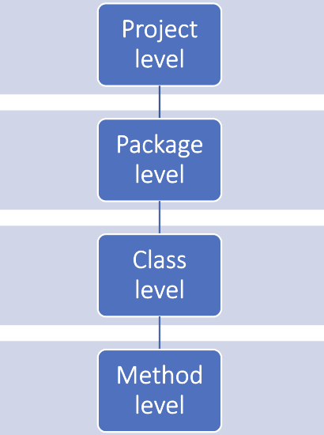

we can messure static metrics on diffrent level 


https://www.sonarsource.com/learn/cyclomatic-complexity/

cyclomatic complexity will be messure on method level.

Cyclomatic complexity – minimum numer of paths that you need to test to ensure each decision point is executed at least once. 
Formula C = E – N + 2P 


Higher cyclomatic complexity means that we need cover more paths. More paths can cause higher probability of bugs. 
Every decision point (loop or condition statement) contribute to a new path. 


```python
    if a: 
        if b: 
            if c: 
                #statement

    if a and b and c: 
        #statement 
```

Cyclomatic complexity code analysis involves reviewing your program’s source code to understand its structure and identify areas where the complexity can be reduced.

calculating cyclomatic complexity for each function or module.


https://github.com/mauricioaniche/ck


LOC (Lines of code): It counts the lines of count, ignoring empty lines and comments (i.e., it's Source Lines of Code, or SLOC). The number of lines here might be a bit different from the original file, as we use JDT's internal representation of the source code to calculate it


CBO (Coupling between objects): Counts the number of dependencies a class has. The tools checks for any type used in the entire class (field declaration, method return types, variable declarations, etc). 

FAN-IN: Counts the number of input dependencies a class has, i.e, the number of classes that reference a particular class. For instance, given a class X, the fan-in of X would be the number of classes that call X by referencing it as an attribute, accessing some of its attributes, invoking some of its methods, etc.

FAN-OUT: Counts the number of output dependencies a class has, i.e, the number of other classes referenced by a particular class. In other words, given a class X, the fan-out of X is the number of classes called by X via attributes reference, method invocations, object instances, etc.


# Checkstyle

.xml to specify types of checks 


```xml
<?xml version="1.0"?>
<!DOCTYPE module PUBLIC
  "-//Puppy Crawl//DTD Check Configuration 1.3//EN"
  "https://checkstyle.org/dtds/configuration_1_3.dtd">
<module name="Checker">
  <module name="TreeWalker">
    <module name="FallThrough"/>
  </module>
</module>
```

basic usage 
```cmd
    C:\checkstyle> java -jar checkstyle-10.21.4-all.jar -c config.xml  C:\checkstyle\testCheckStyle\src\Test.java
Starting audit...
[ERROR] C:\checkstyle\testCheckStyle\src\Test.java:17:17: Fall through from previous branch of the switch statement. [FallThrough]
Audit done.
Checkstyle ends with 1 errors.
```

```cmd
C:\checkstyle> java -jar checkstyle-10.21.4-all.jar -c sun_checks.xml  C:\checkstyle\testCheckStyle\src\Test.java
Starting audit...
[ERROR] C:\checkstyle\testCheckStyle\src\Test.java:1: File does not end with a newline. [NewlineAtEndOfFile]
[ERROR] C:\checkstyle\testCheckStyle\src\Test.java:1: Missing package-info.java file. [JavadocPackage]
[ERROR] C:\checkstyle\testCheckStyle\src\Test.java:13:13: switch without "default" clause. [MissingSwitchDefault]
[ERROR] C:\checkstyle\testCheckStyle\src\Test.java:17:22: '3' is a magic number. [MagicNumber]
Audit done.
Checkstyle ends with 4 errors.

```


```cmd 
C:\checkstyle> java -jar checkstyle-10.21.4-all.jar  -T  C:\checkstyle\testCheckStyle\src\Test.java
COMPILATION_UNIT -> COMPILATION_UNIT [6:0]
`--CLASS_DEF -> CLASS_DEF [6:0]
    |--MODIFIERS -> MODIFIERS [6:0]
    |--BLOCK_COMMENT_BEGIN -> /* [1:0]
    |   |--COMMENT_CONTENT -> *\r\n * Javadoc summary.\r\n *\r\n * Some description.\r\n  [1:2]
    |   `--BLOCK_COMMENT_END -> */ [5:1]
    |--LITERAL_CLASS -> class [6:0]
    |--IDENT -> Test [6:6]
    `--OBJBLOCK -> OBJBLOCK [6:11]
        |--LCURLY -> { [6:11]
        |--METHOD_DEF -> METHOD_DEF [10:4]
        |   |--MODIFIERS -> MODIFIERS [10:4]
        |   |   |--BLOCK_COMMENT_BEGIN -> /* [7:4]
        |   |   |   |--COMMENT_CONTENT -> *\r\n     * Some summary on method.\r\n      [7:6]
        |   |   |   `--BLOCK_COMMENT_END -> */ [9:5]
        |   |   `--LITERAL_PUBLIC -> public [10:4]
        |   |--TYPE -> TYPE [10:11]
        |   |   `--LITERAL_VOID -> void [10:11]
        |   |--IDENT -> foo [10:16]
        |   |--LPAREN -> ( [10:19]
        |   |--PARAMETERS -> PARAMETERS [10:20]
        |   |--RPAREN -> ) [10:20]
        |   `--SLIST -> { [10:22]
        |       |--VARIABLE_DEF -> VARIABLE_DEF [11:8]
        |       |   |--MODIFIERS -> MODIFIERS [11:8]
        |       |   |--TYPE -> TYPE [11:8]
        |       |   |   `--LITERAL_INT -> int [11:8]
        |       |   |--IDENT -> i [11:12]
        |       |   `--ASSIGN -> = [11:14]
        |       |       `--EXPR -> EXPR [11:16]
        |       |           `--NUM_INT -> 0 [11:16]
        |       |--SEMI -> ; [11:17]
        |       |--LITERAL_WHILE -> while [12:8]
        |       |   |--LPAREN -> ( [12:14]
        |       |   |--EXPR -> EXPR [12:17]
        |       |   |   `--GE -> >= [12:17]
        |       |   |       |--IDENT -> i [12:15]
        |       |   |       `--NUM_INT -> 0 [12:20]
        |       |   |--RPAREN -> ) [12:21]
        |       |   `--SLIST -> { [12:23]
        |       |       |--LITERAL_SWITCH -> switch [13:12]
        |       |       |   |--LPAREN -> ( [13:19]
        |       |       |   |--EXPR -> EXPR [13:20]
        |       |       |   |   `--IDENT -> i [13:20]
        |       |       |   |--RPAREN -> ) [13:21]
        |       |       |   |--LCURLY -> { [13:23]
        |       |       |   |--CASE_GROUP -> CASE_GROUP [14:16]
        |       |       |   |   |--LITERAL_CASE -> case [14:16]
        |       |       |   |   |   |--EXPR -> EXPR [14:21]
        |       |       |   |   |   |   `--NUM_INT -> 1 [14:21]
        |       |       |   |   |   `--COLON -> : [14:22]
        |       |       |   |   |--LITERAL_CASE -> case [15:16]
        |       |       |   |   |   |--EXPR -> EXPR [15:21]
        |       |       |   |   |   |   `--NUM_INT -> 2 [15:21]
        |       |       |   |   |   `--COLON -> : [15:22]
        |       |       |   |   `--SLIST -> SLIST [16:21]
        |       |       |   |       |--EXPR -> EXPR [16:21]
        |       |       |   |       |   `--POST_INC -> ++ [16:21]
        |       |       |   |       |       `--IDENT -> i [16:20]
        |       |       |   |       `--SEMI -> ; [16:23]
        |       |       |   |--CASE_GROUP -> CASE_GROUP [17:16]
        |       |       |   |   |--LITERAL_CASE -> case [17:16]
        |       |       |   |   |   |--EXPR -> EXPR [17:21]
        |       |       |   |   |   |   `--NUM_INT -> 3 [17:21]
        |       |       |   |   |   `--COLON -> : [17:22]
        |       |       |   |   `--SLIST -> SLIST [18:21]
        |       |       |   |       |--EXPR -> EXPR [18:21]
        |       |       |   |       |   `--POST_INC -> ++ [18:21]
        |       |       |   |       |       |--SINGLE_LINE_COMMENT -> // [17:24]
        |       |       |   |       |       |   `--COMMENT_CONTENT ->  violation\r\n [17:26]
        |       |       |   |       |       `--IDENT -> i [18:20]
        |       |       |   |       `--SEMI -> ; [18:23]
        |       |       |   `--RCURLY -> } [19:12]
        |       |       `--RCURLY -> } [20:8]
        |       `--RCURLY -> } [21:4]
        `--RCURLY -> } [22:0]
```

```cmd
C:\checkstyle> java -jar checkstyle-10.21.4-all.jar  -c config.xml --exclude-regexp "Person.java"  C:\checkstyle\testCheckStyle\src
Starting audit...
[ERROR] C:\checkstyle\testCheckStyle\src\Test.java:17:17: Fall through from previous branch of the switch statement. [FallThrough]
Audit done.
Checkstyle ends with 1 errors.
```

cyclomatic complexity is the same for both functions (equal 4)
```java
 public class Person {

    private int age;
    private String name;
    private String lastName;
    private final int childLimit = 18;

    public void conditions(){
        if(age < 12 && lastName == "Doe" && name == "John"){
            age++;
        }
    }

    public void conditions2(){
        if(age < 12){
            if(lastName == "Doe"){
                if(name == "John"){
                    age++;
                }
            }

        }
    }

}

```