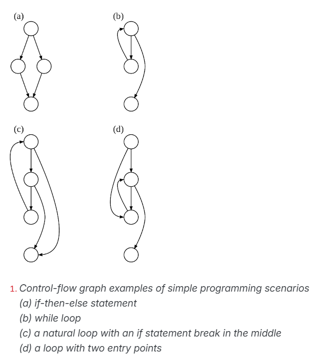

We can measure static metrics at different levels. <br>
https://www.sonarsource.com/learn/cyclomatic-complexity/ <br>
Cyclomatic complexity is measured at the method level.
Cyclomatic complexity – the minimum number of paths that need to be tested to ensure each decision point is executed at least once.
Formula: C = E – N + 2P



Higher cyclomatic complexity means that more paths need to be covered. More paths can lead to a higher probability of bugs.
Every decision point (loop or conditional statement) contributes to a new path.


```python
    if a: 
        if b: 
            if c: 
                #statement

    if a and b and c: 
        #statement 
```

Cyclomatic complexity code analysis involves reviewing your program’s source code to understand its structure and identify areas where the complexity can be reduced.
Calculating cyclomatic complexity for each function or module.

https://github.com/mauricioaniche/ck

LOC (Lines of code): It counts the lines of count, ignoring empty lines and comments (i.e., it's Source Lines of Code, or SLOC). The number of lines here might be a bit different from the original file, as we use Java Development Tools internal representation of the source code to calculate it

CBO (Coupling between objects): Counts the number of dependencies a class has. The tools checks for any type used in the entire class (field declaration, method return types, variable declarations, etc). 

FAN-IN: Counts the number of input dependencies a class has, i.e, the number of classes that reference a particular class. For instance, given a class X, the fan-in of X would be the number of classes that call X by referencing it as an attribute, accessing some of its attributes, invoking some of its methods, etc.

FAN-OUT: Counts the number of output dependencies a class has, i.e, the number of other classes referenced by a particular class. In other words, given a class X, the fan-out of X is the number of classes called by X via attributes reference, method invocations, object instances, etc.


