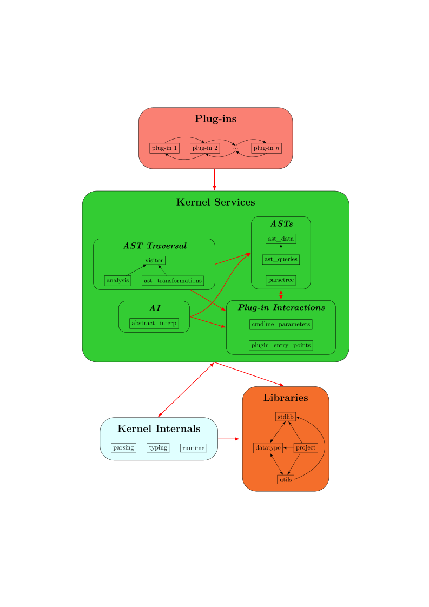

# Report: Frama-C

#### Disclaimer

Most of this report is based on the documentation available [here](https://www.frama-c.com/download/frama-c-plugin-development-guide.pdf). I will be referring to specific sections of the guide throughout the report. At the time of writing, the guide describes Frama-C 30.0 (Zinc).

## 1: User interface

Frama-C offers both a CLI and a GUI to run analyses. I have only used the CLI.

Configuration values for specific plugins are passed using named parameters, prefixed by the plugin "shortname". Calling `frama-c --help` lists all options of all registered plugins. Unnamed parameters refer to source files or directories to be analysed.

Some plugins have dependencies between each other, e.g. a plugin that computes the control flow graph needs to be run before a plugin that analyses this CFG. To ensure this, a `-then` parameter is used. Calling `frama-c -plugin1 -plugin2 -then -plugin3 -plugin4 -then -plugin5 ...` ensures that plugins 1 and 2 are executed before 3 and 4, which are executed before 5. Plugins in the same "section" can be thought to execute concurrently. Other `then*` operators are also available. For more details see section 2.4.3 of the [guide](#disclaimer).

While the tool offers "persistent" sessions that can be loaded once analysis is started, AFAIK, modifying the analysed source requires starting a new analysis.

## 2: Available metrics

The tool centers around formal methods, proving properties of C programs, etc.
A list of official plugins can be found [here](https://frama-c.com/html/kernel-plugin.html). However, such formal analyses are not mentioned by our project requirements.

Instead, I will focus on a suite of custom plugins extending the framework with code coverage functionalities. These are [LAnnotate](https://git.frama-c.com/pub/ltest/lannotate) and [LReplay](https://git.frama-c.com/pub/ltest/lreplay).

The LAnnotate [docs](https://git.frama-c.com/pub/ltest/lannotate/-/blob/master/doc/criteria.markdown?ref_type=heads) briefly describe the types of coverage metrics the plugin implements. While some new metrics are omitted from the doc, the most fundamental ones are there.

The plugin instruments the given source code by injecting lines calling some macros (`pc_label`) that will be tracked during test execution by LReplay. This isn't very comfortable when porting existing test suites to be instrumented, much less if a testing framework like GTest is already in use, which is why this plugin is mostly maintained for research purposes.

The coverage metrics our MVP should include would probably be:

- Decision Coverage - Tracks if each `if` node is executed, but not if all branches are executed
- Function Coverage and Function Call Coverage - The metrics track the % of functions executed by the suite and the % of function calls, respectively.

This is a conservative estimate. If overall efforts maintain the current development velocity, this list could be expanded.

## 3: Extensibility

The [guide](#disclaimer) goes into detail about plugin development. A plugin is basically a dune library, that calls the `Boot.Main.extend` function to register the plugin with the kernel. It is built with `dune build` and the resulting artifacts are moved to Frama-C's installed directory using `dune install`.

The guide describes two "dummy" plugins. One just logs "Hello, world!" to the console on each invocation of `frama-c`, while the other computes the CFG of an input program in .dot format. These are described by sections 2.3 and 2.4, respectively.

## 4: Architecture

The above diagram visualizes the architecture, as well as the structure of the kernel repository. It is lifted from section 3 of the [guide](#disclaimer), which describes its components in detail.

Projects are consumed by the CLI by specifying each source file explicitly. As an alternative, Frama-C offers the `frama-c-script` command, which can, for example, read the Compilation Database (CDB) of a project, in the form of a `compile_commands.json` file, which can be exported by most build tools for C like CMake. Based on this file a suite of scripts is generated in the file `GNUmakefile`, which can then be ran to parse the project, run specific analyses and open the GUI. I have not tested this feature thoroughly, as I've only worked with single source files, but the framework is well documented and thus finding out more details shouldn't be difficult.

Frama-C implements its own parsing and semantic analysis. This is the focus of the `parsing` and `typing` directories. The untyped AST spec is contained in `src/kernel_services/parsetree/cabs.ml`. The typed AST spec is in `src/kernel_services/ast_data/cil_types.ml`.

CIL is actually an acronym for [C Intermediate Language](https://en.wikipedia.org/wiki/George_Necula#C_Intermediate_Language) initially developed at the University of California, Berkeley by George Necula. The Frama-C fork has since diverged enough to now be considered its own entity, but the prototype probably used the original CIL parsing and semantic analysis.

Plugins are linked together via dynamic linking, mainly using the [Dynlink](https://ocaml.org/manual/5.3/libdynlink.html) library. In particular, dependencies between plugins are allowed and can even contain cycles, though this requires a different way of specifying them (Section 4.8 of the [guide](#disclaimer)).
